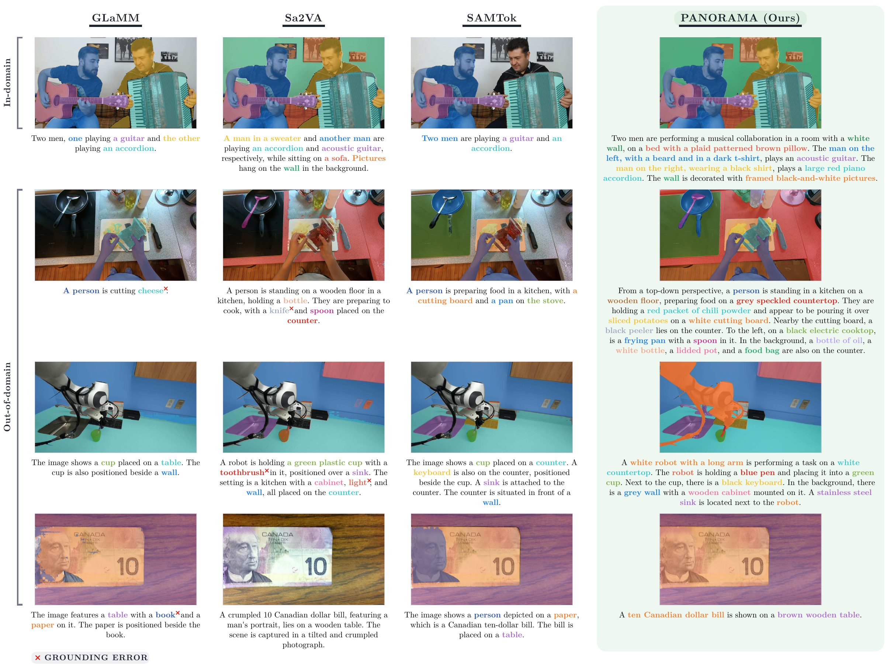

<h1 align="center">
  PANORAMA: Panoptic Grounded Captioning via Mask Proposal Selection
</h1>

<div align="center">

<a href="https://scholar.google.com/citations?user=jLNKLsgAAAAJ&hl=en&oi=ao">Sara Pieri</a><sup>1</sup>, 
<a href="https://scholar.google.com/citations?user=a1vQE0cAAAAJ&hl=en&oi=ao">Evangelos Kazakos</a><sup>2</sup>, 
<a href="https://scholar.google.com/citations?user=wZhRRy0AAAAJ&hl=en&oi=ao">Shizhe Chen</a><sup>1</sup>, 
<a href="https://scholar.google.com/citations?user=NCtKHnQAAAAJ&hl=en&oi=ao">Josef Sivic</a><sup>2</sup>, 
<a href="https://scholar.google.com/citations?user=IvqCXP4AAAAJ&hl=en">Cordelia Schmid</a><sup>1</sup>
<br><br>
<sup>1</sup> Inria, École normale supérieure, CNRS, PSL Research University  
<br>
<sup>2</sup> Czech Institute of Informatics, Robotics and Cybernetics, Czech Technical University in Prague  

[](https://arxiv.org/abs/2609.19143)
[](https://huggingface.co/Panorama-grounding)
[](https://www.di.ens.fr/willow/research/panorama/)

</div> 

### TL;DR

This repository contains the implementation of **[PANORAMA](https://arxiv.org/abs/2609.19143)**, a VLM for panoptic grounded captioning that formulates phrase grounding as selection from a phrase-conditioned pool of mask proposals: a pretrained segmenter is conditioned on the contextualized representation of each phrase to obtain candidate masks, and the model learns to select those corresponding to the phrase, whether a single region, multiple instances, or none.
The project also introduces **[PanoCaps](https://huggingface.co/datasets/Panorama-grounding/PanoCaps)**, a human-annotated panoptic grounded captioning benchmark with approximately 99% pixel coverage, fine-grained phrase–mask alignments, free-form full-scene captions, and diverse image sources.

<p align="center">
  
</p>

---
## 📢 Latest Updates
<!-- - 🚀 Our models are available on [Hugging Face](https://huggingface.co/Panorama-grounding)! -->
- 🤗 Our data is available on Hugging Face: the [PanoCaps](https://huggingface.co/datasets/Panorama-grounding/PanoCaps) benchmark, plus the [COCONut-PanCap-Recaptioned](https://huggingface.co/datasets/Panorama-grounding/COCONut-PanCap-Recaptioned) and [MRSeg-Referring-Expressions](https://huggingface.co/datasets/Panorama-grounding/MRSeg-Referring-Expressions) training sets!
- 💻 Training, finetuning and evaluation code released.

---
## 📦 Datasets

[All data](https://huggingface.co/Panorama-grounding) is hosted on our Hugging Face page.

- **[PanoCaps](https://huggingface.co/datasets/Panorama-grounding/PanoCaps)**: our human-annotated benchmark for panoptic grounded captioning: detailed scene-level captions paired with pixel-level panoptic masks for every mentioned entity. About 3.5K images, 34K masks and 17.9K unique phrases, with referenced regions covering ≈99% of image pixels, so both foreground objects and background regions are described.
- **[COCONut-PanCap-Recaptioned](https://huggingface.co/datasets/Panorama-grounding/COCONut-PanCap-Recaptioned)**: regenerated grounded captions for the 118K COCONut-PanCap training images.
- **[MRSeg-Referring-Expressions](https://huggingface.co/datasets/Panorama-grounding/MRSeg-Referring-Expressions)**: 101K single-turn referring expressions adapted from the multi-granularity MR-Seg data of SegLLM.

---
## Installation

Environment: **Python 3.11**, **torch ≥2.6 (CUDA 12.4)**. Java 8 must be on the path for the GCG caption metrics.
The pinned set is in [`requirements.txt`](requirements.txt).

### 1) Create the env
```bash
conda create -n panorama python=3.11 -y
conda activate panorama
pip install --upgrade pip
cd panorama_grounding
```

### 2) Install dependencies
```bash
# 1) torch first
pip install torch==2.6.0 torchvision==0.21.0 --index-url https://download.pytorch.org/whl/cu124

# 2) the pinned stack, including transformers 4.57.1
pip install -r requirements.txt

# 3) xtuner
pip install --no-deps --ignore-requires-python "xtuner==0.1.23"

# 4) flash-attn, prebuilt wheel for torch 2.6 / cu124 / cp311
#    (optional: without it, set PANORAMA_ATTN_IMPL=sdpa in .env)
pip install "https://github.com/Dao-AILab/flash-attention/releases/download/v2.7.3/flash_attn-2.7.3+cu12torch2.6cxx11abiFALSE-cp311-cp311-linux_x86_64.whl"

# 5) capture_metric
pip install capture_metric

# 6) nvcc
#    (optional: only if the machine has no CUDA toolkit; DeepSpeed reads the CUDA version from it)
conda install -c nvidia cuda-nvcc=12.4 -y

# 7) Java 8
#    (optional: only for the GCG caption metrics, and only if the machine has no Java 8;
#     newer Java breaks SPICE)
conda install -c conda-forge "openjdk=8" -y
```

### 3) Pre-download models and NLTK corpora
The models are fetched on first use; the NLTK corpora are not, and the PanoCaps CAPTURE metric is
skipped without them.
```bash
hf download Qwen/Qwen3-VL-4B-Instruct                 # training: VLM backbone
hf download bert-base-uncased                         # GCG metrics
hf download sentence-transformers/all-mpnet-base-v2   # PanoCaps metrics (CAPTURE)
hf download lizhuang144/flan-t5-base-VG-factual-sg    # PanoCaps metrics (CAPTURE parser)
python -m nltk.downloader wordnet omw-1.4 punkt_tab averaged_perceptron_tagger_eng   # eval synonyms and tokenizers
```

### 4) SAM 3 weights, configure, sanity check
Training and checkpoint conversion need the SAM 3 weights (`sam3.pt`). The model is gated: accept the license on its [Hugging Face page](https://huggingface.co/facebook/sam3) first.
```bash
hf download facebook/sam3   # gated: request access on the model page first, then `hf auth login`
                            # prints the download path; point PANORAMA_SAM3_PATH at its sam3.pt
cp .env.example .env        # then fill in your paths; the configs read this file, not exported variables
python -c "from transformers import Qwen3VLForConditionalGeneration; print('Qwen3-VL OK')"
python -c "import xtuner, mmengine, deepspeed; print('stack OK')"   # add flash_attn if installed
```

---
## Quick Start

### PanoCaps Benchmark

The commands below use `/path/to/data`, the folder `PANORAMA_DATA_ROOT` points to in `.env`.

> **Quickest path:** the images **and annotations** are available **pre-extracted and formatted**
> at this [Google Drive link](https://drive.google.com/file/d/1iNEuKWJdv1wKKGycP-4hTKHdfmcuQEOB/view?usp=sharing),
> which gives you `/path/to/data/PanoCaps/{annotations,images}/`:
>
> ```bash
> pip install gdown
> gdown 1iNEuKWJdv1wKKGycP-4hTKHdfmcuQEOB -O PanoCaps.zip
> unzip PanoCaps.zip -d /path/to/data/
> ```

**Second path**: rebuild it yourself with the instructions below.

#### 1) Download annotations
Download the **PanoCaps** annotations from [Hugging Face](https://huggingface.co/datasets/Panorama-grounding/PanoCaps):

```bash
hf download Panorama-grounding/PanoCaps --repo-type dataset --include "annotations/*" \
    --local-dir /path/to/data/PanoCaps
```

> **Note:** Images are **not** included in this repository. See the Hugging Face page for further details and the annotation format.

#### 2) Download source images
| Dataset | Download | Paper |
|---|---|---|
| ADE20K | [Website](https://groups.csail.mit.edu/vision/datasets/ADE20K/) | [arXiv](https://arxiv.org/abs/1608.05442) |
| COCONut | [GitHub](https://github.com/bytedance/coconut_cvpr2024) | [arXiv](https://arxiv.org/abs/2404.08639) |
| VIPSeg | [GitHub](https://github.com/VIPSeg-Dataset/VIPSeg-Dataset/) | [CVF](https://openaccess.thecvf.com/content/CVPR2022/html/Miao_Large-Scale_Video_Panoptic_Segmentation_in_the_Wild_A_Benchmark_CVPR_2022_paper.html) |

Needed from each: ADE20K `images/{training,validation}`; the COCO images of COCONut, `train2017`
for the train split and `val2017` for val and test; VIPSeg's original frames (`VIPSeg/imgs`, resized
to 720p by the script below).

#### 3) Collect the required images
Edit `DATASET_PATHS` in `data/copy_images.py` to point to your local copies of the source datasets, then run:

```bash
python data/copy_images.py --annotation-dir /path/to/data/PanoCaps/annotations \
    --output-dir /path/to/data/PanoCaps
```

This copies only the images referenced by PanoCaps into `/path/to/data/PanoCaps/images/{train,test_val}/`.

### Evaluation on PanoCaps

**Our models.** Evaluate a PANORAMA model on [PanoCaps](https://huggingface.co/datasets/Panorama-grounding/PanoCaps), either our released HF model or a checkpoint you trained and converted:

```bash
MODEL_PATH=/path/to/panorama_4b/hf bash scripts/eval_panocaps.sh
```

`scripts/eval_panocaps.sh` writes predictions with 4 GPUs and reports metrics on the validation and test splits separately (`GPUS=N` overrides it, as it does for every script here).

**Your own model.** The scorer runs on its own on a folder of per-image predictions, so any model can be evaluated on PanoCaps:

```bash
python -m eval.metrics_panocaps --split val test \
    --prediction_dir_path /path/to/predictions --gt_dir_path /path/to/data/PanoCaps/annotations
```

The folder holds one `<image_id>.json` per image with the fields `image_id`, `caption` (plain text), `phrases` (the grounded phrases, in caption order), `phrase_seg_counts` (number of masks per phrase) and `pred_masks` (COCO RLE, one per mask, in phrase order); see `process_and_save_output` in `eval/panocaps_eval.py` for a reference writer. Reported metrics: gPQ, Recall, Precision, AP50, mIoU and CAPTURE.

### Training data

The mixture reads every path from `.env` (see `.env.example`). PanoCaps is one of our three
training sets (above); the other two:

```bash
hf download Panorama-grounding/COCONut-PanCap-Recaptioned --repo-type dataset \
    --local-dir /path/to/data/COCONut_PanCap
tar -xf /path/to/data/COCONut_PanCap/caption_train2017.tar -C /path/to/data/COCONut_PanCap

hf download Panorama-grounding/MRSeg-Referring-Expressions --repo-type dataset \
    --local-dir /path/to/data/MRSeg-Referring-Expressions
mkdir -p /path/to/data/mrseg_extract && tar -xf /path/to/data/MRSeg-Referring-Expressions/mrseg_accepted.tar \
    -C /path/to/data/mrseg_extract   # accepted/*.jsonl, PANORAMA_MRSEG_EXTRACT in .env
```

**COCONut-S panoptic masks** (`PANORAMA_COCONUT_MASKS`): the PNGs are on
[Kaggle](https://www.kaggle.com/datasets/xueqingdeng/coconut);
[xdeng77/coconut_s](https://huggingface.co/datasets/xdeng77/coconut_s) has the same masks as parquet:

```python
import glob, os, pyarrow.parquet as pq
out = '/path/to/data/COCONut_PanCap/coconut_s/panoptic'
os.makedirs(out, exist_ok=True)
for f in sorted(glob.glob('/path/to/coconut_s/data/*.parquet')):
    for b in pq.ParquetFile(f).iter_batches(batch_size=512, columns=['mask', 'segments_info']):
        for mask, info in zip(b.column('mask').to_pylist(), b.column('segments_info').to_pylist()):
            open(f"{out}/{info['file_name']}", 'wb').write(mask['bytes'])
```

The other buckets come from their original releases: RefCOCO/+/g and GCG in the Sa2VA-Training
layout, gRefCOCO, PhraseCut, and the images they share (COCO `train2017` and `train2014`, Visual
Genome, ADE20K, PASCAL VOC 2010). `.env.example` names the variable for each.

### Training

Fill in your paths first (`cp .env.example .env`).

The mixture config of PANORAMA-4B is `src/configs/panorama_4b.py`.

```bash
CONFIG=src/configs/panorama_4b.py bash scripts/train.sh     # train
CONFIG=src/configs/panorama_4b.py bash scripts/convert.sh   # convert the checkpoint to HF format
```

`scripts/train.sh` runs single-node `torchrun`; on a cluster, wrap it in your scheduler. The
paper's runs use 16 GPUs with an effective batch of 128 (see the comment in `scripts/train.sh`
for how the per-GPU batch is set).

Per-benchmark finetuning starts from the mixture-trained checkpoint and uses the same two
scripts. As an example, `panorama_4b_ft_refcoco.py` finetunes the 4B model on RefCOCO/+/g.

### Other benchmarks

Scripts for the other benchmarks of the paper (GCG, RefCOCO/+/g, gRefCOCO, GroundingSuite-Eval) are provided alongside `scripts/eval_panocaps.sh`; they take the same `MODEL_PATH` and locate the benchmark data through `.env`.

---
## 📜 License
This repository is released under the
[Creative Commons Attribution-NonCommercial 4.0 International License](LICENSE) (CC BY-NC 4.0),
i.e. for **research and non-commercial use only**. The code, pretrained models, and PanoCaps
dataset may not be used for commercial purposes.

The PanoCaps dataset includes images originating from public panoptic datasets; these images are redistributed under their respective **non-commercial research licenses**, and must not be used outside research contexts.

Code under `third_parts/` keeps its own license (SAM License, Apache 2.0), with a copy in each folder. 


---
## 📌 Citation

If you find our work useful for your research, please consider citing our [paper](https://arxiv.org/abs/2609.19143):
```bibtex
@article{pieri2026panorama,
  title   = {PANORAMA: Panoptic Grounded Captioning via Mask Proposal Selection},
  author  = {Pieri, Sara and Kazakos, Evangelos and Chen, Shizhe and Sivic, Josef and Schmid, Cordelia},
  journal = {arXiv preprint arXiv:2609.19143},
  year    = {2026}
}
```

---
## Acknowledgements
This codebase builds on top of prior work including [Sa2VA](https://github.com/bytedance/Sa2VA), [Qwen3-VL](https://github.com/QwenLM/Qwen3-VL), [SAM 3](https://github.com/facebookresearch/sam3), and associated open-source ecosystems. We thank the authors and maintainers of these projects.
